# Pure P2P Architecture - NEVER FORGET

This document ensures we never accidentally implement server-side data storage again.

## 🎯 Core Principle: SERVERLESS P2P

**The worker is a PHONE BOOK, not a database.**

## What the Worker Does (ONLY)

```
POST /rooms → Generate UUID
POST /discovery/register → Store roomId + IP mapping  
GET /discovery/peers → Return other IPs for a room
GET /health → "IP discovery only"
```

## What the Worker NEVER Does

- ❌ Store tasks, user data, or any application state
- ❌ Handle WebRTC signaling or relay messages
- ❌ Track user connections or analytics  
- ❌ Sync data between browsers
- ❌ Validate, transform, or process task data

## How P2P Actually Works

1. **Tech A** creates room → gets UUID from worker
2. **Tech A** registers IP → worker maps UUID → IP
3. **Tech B** joins UUID → worker gives Tech B the IP of Tech A  
4. **Tech B** connects DIRECTLY to Tech A's browser
5. **All task sync happens browser ↔ browser**
6. **Worker is completely out of the loop**

### P2P Communication Protocol Details

```mermaid
flowchart TD
    A[Browser opens app] --> B[Register with Discovery Service<br/>HTTP POST to worker:8787]
    B --> C[Get peer IPs<br/>HTTP GET from worker:8787]
    C --> D[Initiate WebRTC handshake<br/>Offers/Answers via worker:8787]
    D --> E[Establish direct P2P connection<br/>WebRTC Data Channel]
    E --> F[Task sync via data channel<br/>JSON messages, Dynamic ports]
    
    G[comp → worker:8787] --> G1[✅ HTTP/REST API]
    H[comp → server:3000] --> H1[✅ Vite dev server]
    I[comp ↔ comp] --> I1[🔍 WebRTC Data Channel<br/>Ports: Dynamic 49152-65535]
    
    style I1 fill:#ffeeee
    style G1 fill:#eeffee
    style H1 fill:#eeffee
```



## Debugging P2P Communication Issues

### What Actually Happens (Protocol Breakdown)

1. **Discovery Phase** (HTTP to worker:8787) ✅
   - `POST /rooms` → Get room UUID
   - `POST /discovery/register` → Register IP address  
   - `GET /discovery/peers` → Get other peer IPs
   
2. **WebRTC Handshake** (HTTP to worker:8787) ⚠️
   - `POST /webrtc/offer` → Send SDP offer
   - `GET /webrtc/offer` → Receive SDP offer
   - `POST /webrtc/answer` → Send SDP answer
   - `GET /webrtc/answer` → Receive SDP answer

3. **Direct P2P Connection** (WebRTC Data Channel) ❓
   - **Protocol**: WebRTC over UDP/TCP
   - **Ports**: Dynamic allocation (typically 49152-65535)
   - **Firewall**: May be blocked!
   - **NAT**: Local network should work, internet NAT may fail

### Common P2P Sync Issues

#### ✅ **FIXED: WebRTC Offer/Answer Mismatch**
**Problem**: Offers stored with sender ID, but peers looking for offers addressed to them
**Solution**: Fixed key system to use recipient IDs

#### 🚨 **Current Issue: Data Channel Stuck "connecting"** 

**Problem**: WebRTC data channel stuck in "connecting" state

**Root Causes**:
1. **mDNS ICE candidates**: Using `.local` addresses instead of real IPs
2. **Windows Firewall** blocking dynamic WebRTC ports
3. **ICE candidate priority** issues between devices

**Symptoms in logs**:
```
🗳️ ICE Candidate found: {address: "1c449f36-29de-4bba-963c.local", port: 51272}
📊 Data channel state: connecting (stuck here!)
⚠️ Task added locally only - WebRTC not ready: {readyState: "connecting"}
```

#### 🏥 **FIXED: Clinic Workflow Timeouts**

**Previous timeouts were too aggressive:**
- ❌ Peer discovery: 10 minutes  
- ❌ WebRTC offers: 2 minutes
- ❌ WebRTC answers: 2 minutes

**New clinic-friendly timeouts:**
- ✅ **Peer discovery: 8 hours** (full clinic day)
- ✅ **WebRTC offers: 30 minutes** (allows for breaks/delays)  
- ✅ **WebRTC answers: 30 minutes** (allows for breaks/delays)

**Real Clinic Scenario Now Works:**
```
8:00 AM - Dr. Smith creates room → IP registered for 8 hours
10:30 AM - Dr. Smith leaves for surgery
11:00 AM - Hygienist arrives → Can still join! ✅
2:00 PM - Dr. Jones arrives → Room still active! ✅
6:00 PM - End of day → Room expires naturally
```

**Debug Commands**:
```bash
# Check if WebRTC ports are being blocked
netstat -an | findstr "49152"  # Check for WebRTC ports

# Allow WebRTC through firewall (run as Administrator)
netsh advfirewall firewall add rule name="WebRTC P2P" dir=in action=allow protocol=UDP localportrange=49152-65535
netsh advfirewall firewall add rule name="WebRTC P2P TCP" dir=in action=allow protocol=TCP localportrange=49152-65535
```

## Testing P2P Communication

### Console Logging Strategy

The app now includes comprehensive logging. Open browser DevTools (F12) and look for these key messages:

#### Phase 1: Discovery ✅
```
🔗 Starting pure P2P connection to room: abc-123
✅ Registered IP with discovery service
```

#### Phase 2: WebRTC Handshake ⚠️
```
🔗 Creating LAN-only WebRTC connection to: peer-456
🔍 Debug: WebRTC Configuration - LAN-only mode
🗳️ ICE Candidate found: {type: "host", protocol: "udp", address: "192.168.1.100", port: 51234}
🏁 ICE candidate gathering complete
📤 Sent WebRTC offer via signaling server
📨 Received WebRTC answer - P2P connection established!
```

#### Phase 3: P2P Connection Success 🎉
```
🎉 P2P CONNECTION ESTABLISHED! Direct browser-to-browser link active
🔄 WebRTC Connection State: connected
🧊 ICE Connection State: connected
🎉 WebRTC data channel opened - ready for P2P sync!
```

#### Phase 4: Task Sync Validation 🔄
```
📤 Broadcasting new task via WebRTC: {taskCount: 3, messageSize: 245, dataChannelState: "open"}
✅ Task broadcast completed
📨 Raw message received: 245 bytes
📡 Parsed message: {type: "TASK_SYNC", taskCount: 3, peerId: "peer-456"}
✅ Task sync completed successfully
```

### Debug Commands for Windows

```powershell
# 1. Check network connectivity
ping 192.168.1.100  # Replace with actual peer IP

# 2. Check WebRTC port availability
netstat -an | findstr ":49"   # Look for WebRTC ports
netstat -an | findstr ":50"   # Check higher range too

# 3. Test firewall settings
Test-NetConnection -ComputerName 192.168.1.100 -Port 8787
Test-NetConnection -ComputerName 192.168.1.100 -Port 3000

# 4. Check Windows Firewall rules
netsh advfirewall firewall show rule name="WebRTC P2P"
netsh advfirewall firewall show rule name="Vite Dev Server"

# 5. Temporarily disable Windows Firewall (for testing only!)
netsh advfirewall set allprofiles state off
# Remember to re-enable: netsh advfirewall set allprofiles state on
```

### Manual Testing Checklist

1. **☑️ Discovery Service Connection**
   - Both devices can reach worker on port 8787
   - Room creation works
   - Peer registration successful

2. **☑️ WebRTC Handshake**  
   - ICE candidates are found
   - Offer/answer exchange completes
   - No firewall blocks on dynamic ports

3. **☑️ Data Channel Establishment**
   - Connection state becomes "connected"
   - Data channel opens successfully
   - No errors in console logs

4. **☑️ Task Sync Validation**
   - Messages send and receive properly
   - Task counts match after sync
   - No JSON parsing errors

### Common Failure Points

| Issue | Symptom | Solution |
|-------|---------|----------|
| **Firewall blocked** | ICE gathering fails | Run firewall commands above |
| **Wrong IP detected** | Can't find peers | Check `VITE_SIGNAL_URL` env var |
| **WebRTC timeout** | Connection state stays "connecting" | Restart both browsers |
| **CORS issues** | HTTP errors to worker | Check worker is running on 8787 |
| **Port conflicts** | Can't bind to 3000/8787 | Kill other processes using ports |

## Browser-to-Browser Sync (Current POC)

- **Storage**: localStorage in each browser
- **Discovery**: Use worker to find peer IPs
- **Sync**: Periodic polling between browsers (will evolve to real HTTP)
- **Conflicts**: Last-writer-wins (simple for POC)

## Future P2P Enhancements

- **Direct HTTP servers in browsers** (Service Worker HTTP endpoints)
- **WebRTC data channels** for real-time sync (WITHOUT signaling server)
- **Encrypted browser-to-browser** communication
- **Local network auto-discovery** (eliminate worker entirely)

## RED FLAGS - Never Implement

If anyone suggests these, STOP and refer to this document:

- "Let's store tasks in the worker temporarily"
- "Let's add WebRTC signaling to the worker" 
- "Let's track connected users in the worker"
- "Let's add a database for persistence"
- "Let's proxy data through the worker"

## The Test

If the worker goes down permanently, existing browser connections should keep working and syncing tasks. The worker is only needed for NEW room discovery.

---

**Remember: We're building a P2P app that happens to use a minimal discovery service, NOT a server app with P2P features.**
