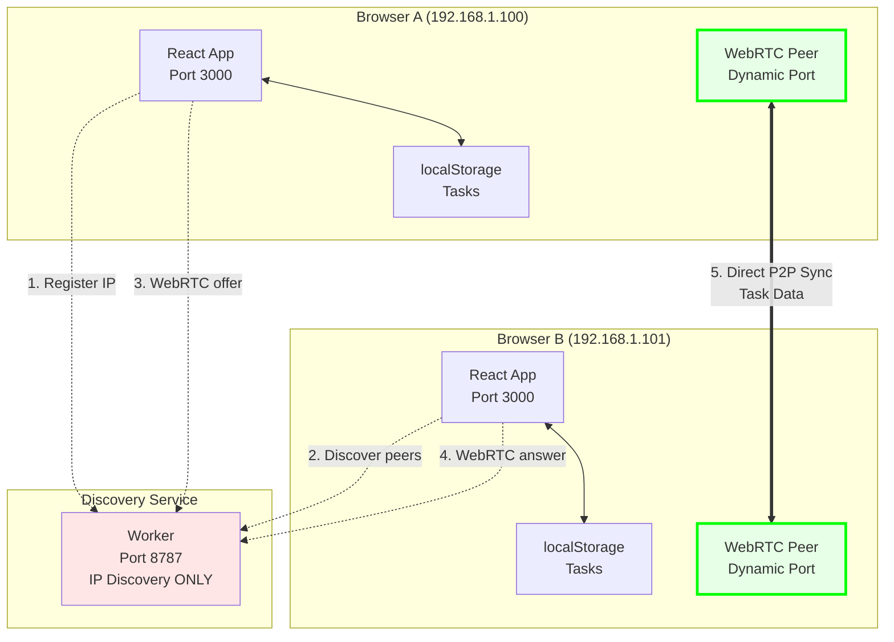

# Scheduler - Pure P2P Work App

A **pure peer-to-peer work application** designed for small clinics. **NO SERVER STORAGE** - only direct browser-to-browser sync.

## 🎯 Core Philosophy: SERVERLESS P2P

**CRITICAL**: This is **NOT a server-based app**. The worker is ONLY a phone book for IP discovery.

## Why This Exists

**Privacy-First**: Data NEVER touches any server. Tasks sync directly between browsers on your network.

**Cost-Effective**: Just pennies for IP discovery. Zero server costs, zero database fees.

**Always Available**: Works entirely peer-to-peer. If worker goes down, existing connections keep working.

## How It ACTUALLY Works

1. **Tech A** opens app → creates room → worker gives Tech A a room UUID
2. **Tech A** registers IP address with worker → starts waiting for peers  
3. **Tech B** joins room UUID → worker gives Tech B the IP of Tech A
4. **Tech B** connects DIRECTLY to Tech A's browser → **WORKER IS FORGOTTEN**
5. **All task data flows browser ↔ browser** - worker never sees tasks

### Communication Flow Diagram

```mermaid
sequenceDiagram
    participant TA as Tech A Browser<br/>(Host)
    participant W as Worker<br/>(Discovery Service)<br/>Port 8787
    participant TB as Tech B Browser<br/>(Joiner)
    
    Note over TA,TB: Phase 1: Room Creation & Discovery
    TA->>W: POST /rooms
    W-->>TA: roomId: "abc-123"
    
    TA->>W: POST /discovery/register<br/>{roomId, peerId}
    W-->>TA: ✅ IP registered
    Note over W: Maps roomId → IP(192.168.1.100)
    
    TB->>W: GET /discovery/peers?roomId=abc-123
    W-->>TB: [{peerId: "host", ip: "192.168.1.100"}]
    
    TB->>W: POST /discovery/register<br/>{roomId, peerId}
    W-->>TB: ✅ IP registered
    
    Note over TA,TB: Phase 2: WebRTC Handshake (via Worker)
    TA->>W: POST /webrtc/offer<br/>{roomId, peerId, offer}
    W-->>TA: ✅ Offer stored
    
    TB->>W: GET /webrtc/offer?roomId=abc-123
    W-->>TB: RTCSessionDescription(offer)
    
    TB->>W: POST /webrtc/answer<br/>{roomId, peerId, answer}
    W-->>TB: ✅ Answer stored
    
    TA->>W: GET /webrtc/answer?roomId=abc-123
    W-->>TA: RTCSessionDescription(answer)
    
    Note over TA,TB: Phase 3: Direct P2P Connection 🚀
    TA<->>TB: WebRTC Data Channel<br/>DIRECT CONNECTION<br/>Port: Dynamic (49152-65535)
    
    Note over W: Worker is now OUT of the loop!
    
    Note over TA,TB: Phase 4: Task Sync (Pure P2P)
    TA->>TB: {type: "TASK_SYNC", tasks: [...]}
    TB->>TA: {type: "TASK_SYNC", tasks: [...]}
    
    Note over TA,TB: Real-time bidirectional sync!<br/>No server involved! 🎉
```

### Architecture Overview



## Architecture: Pure P2P

- **React SPA** - The actual application (hosted on CDN)
- **Worker** - ONLY IP discovery (UUID → IP mapping, that's it!)
- **Browser-to-Browser** - All data sync happens directly between browsers
- **localStorage** - Each browser persists its own data locally

## 🚫 NEVER IMPLEMENT (Anti-Roadmap)

**These would break the pure P2P philosophy:**

- ❌ Task storage in worker
- ❌ WebRTC signaling in worker  
- ❌ Any data persistence in worker
- ❌ User tracking or analytics
- ❌ Server-side task synchronization
- ❌ Central database of any kind

## ✅ Future Enhancements (P2P-Compatible)

- **Better conflict resolution** between browsers
- **Encrypted P2P communication** 
- **File attachment sync** (browser-to-browser)
- **Offline-first improvements**
- **Local network auto-discovery** (eliminate worker entirely)


## Structure:

### Cloudflare Worker (Pure IP Discovery)

**ONLY Job**: Maps room UUIDs to IP addresses. **NEVER STORES TASKS**.

- `POST /rooms` - Generate new room UUID
- `POST /discovery/register` - Register peer's IP address for a room  
- `GET /discovery/peers` - Get other peers' IP addresses in a room
- `GET /health` - Returns "IP discovery only"

**What it NEVER does:**
- ❌ Store tasks or any user data
- ❌ Handle WebRTC signaling  
- ❌ Track connections or users
- ❌ Sync data between browsers

**File**: `src/worker.ts`

### React SPA (Pure P2P)

**Architecture**:

- **Direct browser-to-browser sync** → No intermediate servers
- **localStorage persistence** → Each browser owns its data
- **HTTP discovery** → Simple REST API to find peer IPs  
- **Conflict resolution** → Simple last-writer-wins for POC

**Files**:
- `src/App.tsx` - Main application
- `src/signaling.ts` - HTTP discovery API calls  
- `src/hooks/useDirectP2PSync.ts` - Pure P2P sync logic

## Quick Start

### 1. Setup
```bash
npm run setup
```

### 2. Development (runs both frontend and worker)
```bash
npm start
```

This will start:
- **Cloudflare Worker** (Discovery Service) on `http://0.0.0.0:8787`
- **React Frontend** on `http://0.0.0.0:3000` (or 3001 if 3000 is busy)

### 🌐 LAN Access Setup

To access from other devices on your network:

1. **Check your IP address:**
   ```bash
   # Quick way - just run ipconfig and look for your WiFi/Ethernet adapter
   ipconfig
   
   # Or use our filtered script
   npm run network:info
   npm run network:urls
   ```
   
   Look for an IP like `192.168.x.x` or `10.x.x.x` (not `172.x.x.x` - that's Docker!)

2. **Allow through Windows Firewall:**
   ```bash
   # Allow inbound connections (run as Administrator)
   netsh advfirewall firewall add rule name="Vite Dev Server" dir=in action=allow protocol=TCP localport=3000
   netsh advfirewall firewall add rule name="Cloudflare Worker Dev" dir=in action=allow protocol=TCP localport=8787
   ```

3. **Update discovery service URL** in other device's browser:
   - Instead of `127.0.0.1:8787`, use your actual IP (from step 1)
   - Or set `VITE_SIGNAL_URL=http://YOUR_IP:8787` in .env

### 3. Test P2P Sync

**Local Testing (same device):**
1. Open `http://localhost:3001` in your browser (check terminal for actual port)
2. Click **"Host workspace"** to create a room
3. Copy the room ID that appears
4. Open another browser tab/window to `http://localhost:3001`
5. Enter the room ID and click **"Join"**
6. Add tasks on either side - they sync in real-time via Y.js CRDT! 🎉

**LAN Testing (multiple devices):**
1. Find your IP: `npm run network:info` (look for 192.168.x.x)
2. On host device: Go to `http://YOUR_IP:3001` and create room
3. On other device: Go to `http://YOUR_IP:3001` and join room
4. Tasks sync instantly via direct P2P connections with automatic conflict resolution! 🌐

**Note**: Uses HTTP discovery service to find peers, then establishes direct P2P connections via Y.js WebRTC. No data passes through external servers!

**Development Note**: When you restart the worker dev server (`npm run worker:dev`), room data is cleared but rooms auto-recreate when accessed. URLs and room IDs remain valid!

## 🔧 Debugging P2P Issues

If you're having sync problems, use these debugging tools:

### Quick Debug Commands
```bash
# Check network and firewall configuration
npm run debug:p2p

# Get your LAN IP addresses for multi-device testing
npm run debug:network

# Test basic connectivity
npm run test:connection
```

### 📊 Console Logging
Open browser DevTools (F12) and look for these messages to track P2P connection status:

- **Discovery Phase**: `🔗 Starting pure P2P connection` and `✅ Registered IP`
- **WebRTC Handshake**: `🗳️ ICE Candidate found` and `📤 Sent WebRTC offer`  
- **P2P Success**: `🎉 P2P CONNECTION ESTABLISHED!` and `🎉 WebRTC data channel opened`
- **Task Sync**: `📤 Broadcasting new task` and `📨 Raw message received`

### 🚨 Common Issues & Solutions

| Problem | Quick Fix |
|---------|-----------|
| **"comp → comp ????"** | Run `npm run debug:p2p` → Follow firewall instructions |
| **WebRTC timeout** | Restart both browsers, check Windows Firewall |
| **No peers found** | Verify both devices use same discovery URL |
| **Connection drops** | Check network stability, try closer WiFi |

### Alternative Commands

```bash
# Run components separately
npm run worker:dev    # Just the discovery service
npm run dev          # Just the frontend

# Test the connection
npm run test:connection

# Get network info for LAN access
npm run network:info

# Build for production
npm run build

# Keep dependencies up to date
npm run upgrade:check    # Check for available updates
npm run upgrade          # Upgrade all dependencies to latest

# Deploy to Cloudflare
npm run worker:deploy    # Deploy worker
npm run pages:deploy     # Deploy frontend to Pages
```

## Testing

### Quick Test Commands
```bash
npm test                 # Run unit tests
npm run test:e2e         # Run E2E tests (fully automated)
npm run test:e2e:ts      # Run E2E tests (TypeScript runner)
npm run test:all         # Run all tests (unit + E2E)
npm run test:coverage    # Run with coverage report

# Or use Makefile (recommended)
make test                # Unit tests
make test-e2e            # E2E tests (automated)
make test-all            # All tests
```

### Test Structure
- **Unit Tests** - React components and hooks
- **Integration Tests** - Discovery service communication
- **E2E Tests** - Multi-user collaboration scenarios
- **Worker Tests** - HTTP discovery service functionality

See `src/test/README.md` for detailed testing guide.

## Deploy

### Worker (Discovery Service)
```bash
npm run worker:deploy
```

### Frontend (Cloudflare Pages)
```bash
npm run pages:deploy
```

Update `.env.production` with your deployed worker URL before deploying the frontend.


# Allow inbound connections for both ports
netsh advfirewall firewall add rule name="Vite Dev Server" dir=in action=allow protocol=TCP localport=3000
netsh advfirewall firewall add rule name="Cloudflare Worker Dev" dir=in action=allow protocol=TCP localport=8787